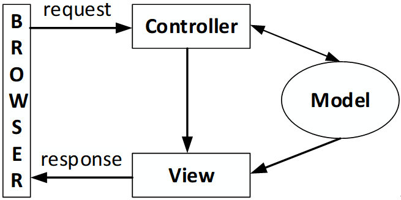
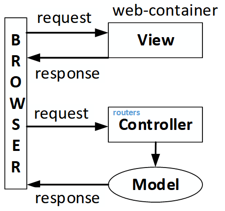
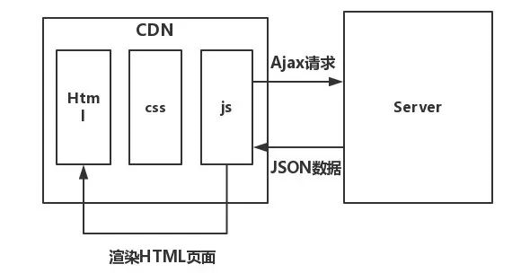
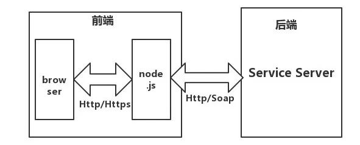

# MVC框架

| 框架                      | 描述                                  |
|:--------------------------|:--------------------------------------|
| 前后端耦合     | web-server传统框架                       |
| 前后端分离     | 非常流行、实用的框架                      |
| 微前端框架     | 前后端分离的特定场景实用                             |

以上框架基本都是从MVC演进过来，熟悉MVC框架，才方便进行后端模块化、面向对象设计。

前后端分离实质：
* 将MC + V进行了分离。View静态资源放在nginx/appache/CDN；
* 业务处理逻辑主要由后端服务器实现；
* 根据业务需要，前端View处理部分业务逻辑；前端主要做呈现，UI渲染、交互；

## 前后端耦合



弊端：

web-server开发人员 前端后端职责不清，甚至两者都要会。


### MVC框架


MVC 分别指的是：

* M: Model（数据)
* V: View （表现）
* C: Controller （逻辑）

在 Node 中，MVC 架构下处理请求的过程如下：

1. 请求抵达服务端
1. 服务端将请求交由路由处理
1. 路由通过路径匹配，将请求导向对应的 controller
1. controller 收到请求，向 model 索要数据
1. model 给 controller 返回其所需数据
1. controller 可能需要对收到的数据做一些再加工
1. controller 将处理好的数据交给 view
1. view 根据数据和模板生成响应内容
1. 服务端将此内容返回客户端

以此为依据，需要准备以下模块：

1. server: 监听和响应请求
1. router: 将请求交由正确的controller处理
1. controllers: 执行业务逻辑，从 model 中取出数据，传递给 view
1. model: 提供数据
1. view: 提供 html

代码结构
创建如下目录：
```
-- server.js
-- lib
	-- router.js
-- views
-- controllers
-- models
```


## 前后端分离



核心思想是前端HTML页面通过AJAX调用后端的RESTFUL API接口并使用JSON数据进行交互。



为了实现各个端（移动端，web端，小程序端等）之间互通，现在优先采用前后端分离架构。

MVC分离为 MC + V：

* V: View静态实现（采用前端 + web-sdk或native-sdk）
* MC： Model（数据）+ Controller（逻辑）由nodejs、go、java等成熟框架实现；

同时前端接入采用nginx做静态和动态分离， View部署在nginx。


## 前后端分离（微前端架构）



Electron采用为前端架构，electron嵌入了chrome和nodejs核。
这种框架在一些对要求比较高的场景可以尝试。如时延要求高，追求极致体验的场景。如webrtc视频通话，视频播放（通过nodejs代理拉取ts分片等优化场景）。

# 参考链接

- [https://developer.mozilla.org/en-US/docs/Glossary/MVC](https://developer.mozilla.org/en-US/docs/Glossary/MVC)

- [https://blog.csdn.net/fuzhongmin05/article/details/81591072](https://blog.csdn.net/fuzhongmin05/article/details/81591072)

- [https://www.cnblogs.com/SheilaSun/p/7294706.html](https://www.cnblogs.com/SheilaSun/p/7294706.html)
